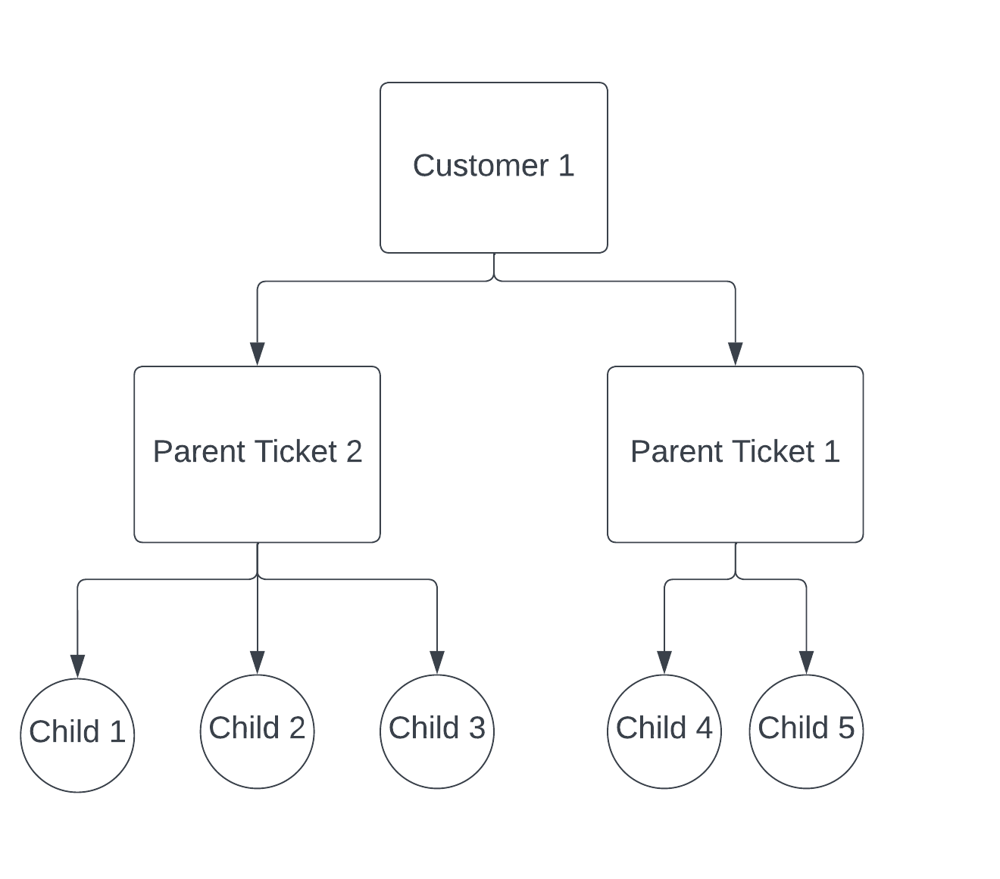
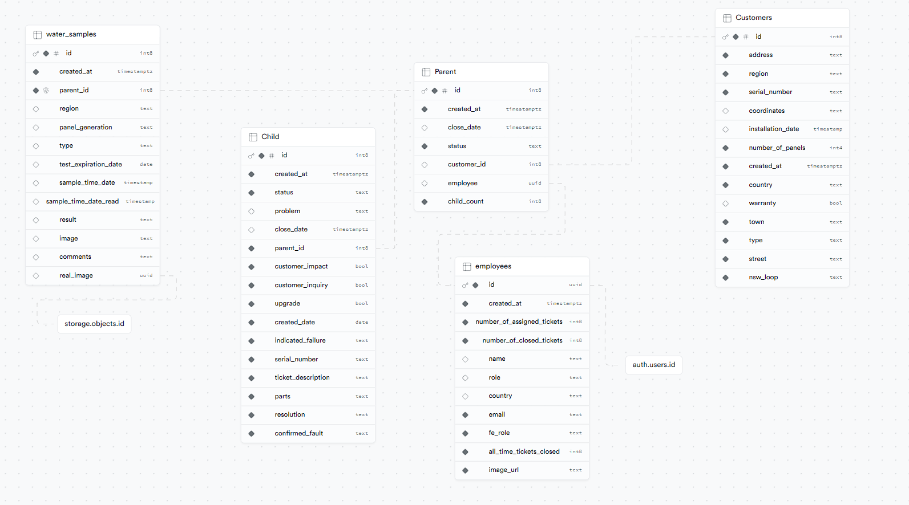
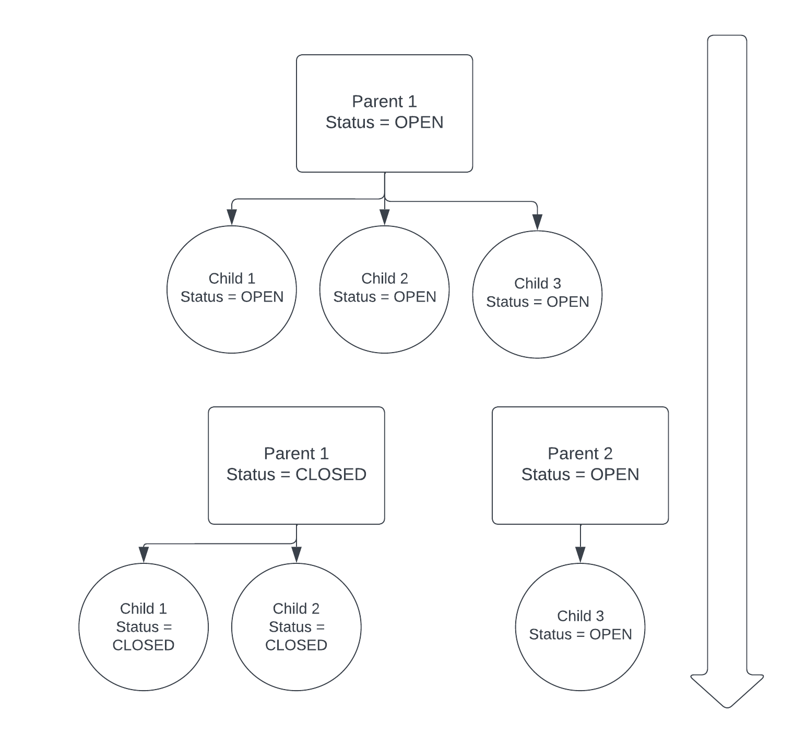

# Table of Content

- [Introduction](#introduction)
- [Technologies Used](#technologies-used)
- [Technical Features](#technical-features)
- [Page Description](#pages)
- [Getting Started](#getting-started)

# Welcome to Thermite

## Introduction

Thermite is a ticketing system inspired by my experience using the various ticketing systems in the water company I worked for before graduating. After graduation I wanted to start a professional project, so I choose to create something similar to the ticketing systems I'm used to working with. Since, I have been a user for those ticketing system I am able to provide detailed requirements/user stories for the project. Thermite combines the best features of existing ticketing systems and adds some unique functionalities to make it more user-friendly.

Thermite is a collaborative project between me and my friend Ali Aizaz. We challenged each other to improve our skills while working remotely across different time zones. This taught us how to collaborate effectively online. This was the project we used to test the extent of our knowledge and go beyond.

## Technologies Used

### Development Tools

Nextjs |
Typescript |
Tailwind CSS |
Node |
Supabase |
PostgreSQL |
Vercel

Compared to my last project Renopilots I have used different technologies. I used Nextjs instead of Reactjs because Nextjs is better at SEO, typescript is used instead of javascript because keeping type safe language helps avoid bugs in the future plus I am a big fan of C++. For backend, I chose Supabase with PostgreSQL over express and MongoDB, because it offers more features and functionality. Finally, the website is deployed on Vercel, I have made a docker image but I cannot afford to run it on AWS or Azure for now.

### Collaboration Tools

Google meets |
Jira |
Github |
Discord

Google meets was used to have meetings to deliberate ideas and fix bugs, it was very convenient to use Google meets as we were able to share our screens and show our ideas more accurately. Jira was used to keep track of tasks and to assign tasks.

## Technical Features

### User Types

Thermite is mainly a ticketing system that consist of tickets which represents the work that needs to be done. So each ticket represents a task that needs to be completed by an employee. Naturally there are 2 main types of users `Site Supervisor`, who assigns tickets and `Site Technician` who has to address or close these tickets. Other than that, there is also an `Admin` who is responsible for managing the ticketing system itself. All of these user types have different views, different permissions and different features.

#### Permissions

- All user are able to change status of the tickets they are able to view.

- Only `Site Supervise` and `Admin` are able to see all the tickets available, while the `Site Technician` is only able to see the tickets that are assigned to them.

- Only `Admin` can create new Employee accounts and delete them.

### Tickets

Thermite's database has 3 main tables to represent tickets; `Customer` table, `Parent Ticket` table and `Child Ticket` table. (**NOTE: There are more tables in the database, but these are the 3 responsible for handling the tickets**)

#### Customers

`Customer` represents all the customers for the company each having their unique `Customer ID`, this is a static table which is almost never supposed to be modified. It has record and details of all the Customers.

#### Parent Ticket

If one of the customer is have trouble with their device, a `Parent Ticket` for that customer is opened to represent that some work needs to be done to their device. A new `Parent Ticket` is opened with a unique `Parent ID` and a foreign key linking it to the `Customer` with `Customer ID`.

#### Child Ticket

Each `Child Ticket` represents a specific task that needs to be completed by a `Site Technician`(Eg. Filters need to be changed or Primary motor needs to be fixed etc.). Multiple `Child Tickets` are linked to a single `Parent Ticket` by its `Parent ID`.

In summary, `Child Tickets` are all the tasks that needs to be done, while `Parent Ticket` and `Customer` are the details of where and for whom the task need to be completed.

**The abstract design of tickets is shown below, a more detailed picture of database schema is shown further down**



- A single `Customer` can have multiple `Parent Tickets` linked to it and each `Parent Ticket` has their own list of `Child Tickets` or tasks.

### Database

The database at the Back-end is a PostgreSQL database which runs on Supabase, it has 5 tables `Customers`, `Parent Ticket` and `Child Ticket` tables which have been explained before, additionally, `Employees` and `Water Sample` tables, former stores the data regarding the employees and latter stores the details provided in a water sample form.

A schema is displayed below



### How does Status work?

`Child Ticket` has 2 status `OPEN` and `CLOSED`, while `Parent Ticket` has 5 status `OPEN`, `PARTS`, `BUSINESS-DECISION`,`WATER-SAMPLE` and `CLOSED`.

By default, a newly opened `Child` or `Parent Ticket` will have `OPEN` status. As the `Site Technician` starts to complete tasks on the `Child Ticket`, he can change the `Child Ticket` status to `CLOSED` and once he turned all the `Child Ticket` status to `CLOSED` he can proceed to close the `Parent Ticket`.

Ideally, the `Site Technician` has to change all the `Child Ticket` status to `CLOSED` before he closes the `Parent Ticket`, but sometimes this is not possible. So, in times where he is not able to close all `Child Tickets` of a particular `Parent Ticket` then the `OPEN` `CHILD TICKET` will decouple from that parent and will link to a newly created `Parent Ticket`.

**Visual Representation is shown below:**



- In the image above, `Child 1` and `Child 2` are closed while `Child 3` remained open. So, when the Parent 1 is closed, `Child 3` no longer remained linked to `Parent 1`, instead a new Parent is created `Parent 2` and `Child 3` links to this newly created Parent. In the end, `Parent 1` is packaged with it's 2 closed child, while the `Child 3` shows up again in the ticket list as an incomplete task.

When closing the `Parent Ticket` the status cannot be directly changed to `CLOSED` instead the status will change from `OPEN` to `WATER-SAMPLE`. In order to escalate the status to `CLOSED` the `Site Technician` must submit the `Water Sample` form related to this ticket. They can click on `WATER-SAMPLE` status to get redirected to `Water sample` form or visit the form using the navbar. Once the `Water Sample` form has been completed the `Parent Ticket` associated with that `Water Sample` form will change it's status from `WATER-SAMPLE` to `CLOSED`. This ensures that no `Parent Ticket` can be closed without the submission of `Water Sample`.

The final two status for the `Parent Ticket` are `PARTS`and `BUSINESS-DECISION`, which are flags for the ticket. `PARTS` status indicate that the `Site Technician` wasn't able to complete the task or close the ticket because they did not have adequate parts on them. `BUSINESS-DECISION` status indicate that the `Site Technician` was unable to visit the site because of a permanent external interference, such as the house being burnt down or the owners of the house refusing entry.

## Pages

### Dashboard

After signing in you will be dropped onto the `Dashboard` page. This page gives an extensive summary of all the available work. It displays 6 different cards:

- `Assigned Ticket` Card : Displays the number of tickets assigned to the logged in employee.

- `Easy Assign` Card : Admin can bulk assign tickets to employees using this, comes in handy when you want to assign a whole town's tickets to an employee.

- `All time tickets Closed` Card : Functionality of this chart has not been implemented due to there being very small quantity of data available. This shows the number of tickets assigned and the number of tickets closed by the logged in employee for each month.

- `Assigned Ticket Details` Card : Functionality of this chart has not been implemented due to there being very small quantity of data available. This chart is a visual representation of available work.

- `Top Towns` Card : Functionality of this chart has not been implemented due to there being very small quantity of data available. This chart shows the top 5 towns with the most available work.

- `Water Sample` Card : This card indicates the number of water sample that needs to be submitted. **(NOTE: Remember, the `Parent` ticket cannot be closed without submitting the `Water Sample`, so it is imperative to keep track of all the `Water Samples` that need to be submitted)**

### Tickets

Tickets page shows all available parent tickets. `Search bar` and `Status Filter` can be used to filter the tickets that the user wishes to see. By default, the tickets with `CLOSED` status are hidden, this is because, they are not relevant to the user in most cases and as their number will keep on increasing, they will eventually saturate the user's view. However, if the user wishes to see a `CLOSED` ticket, they may do so by toggling `Show Closed` button. Finally, a new Parent Ticket may be created using the `New Parent Ticket` button at the top right corner of the table.

Clicking on any of the `Parent` ticket will take you to it's details page, where you can see more details of that `Parent` ticket as well as view all of it's `Child` tickets. Here, you have the option to `Assign` employee from the `Parent Ticket Details` panel on the right and on the same panel, there is also an option to change the status of the `Parent` ticket. In order to select the status of a `Parent` ticket, click on the drop down list and select a status, then click update. Changing the status to `WATER-SAMPLE` in particular is irreversible, after selecting that status you will be prompted to submit a water sample, once you submit a water sample for this `Parent` ticket then this `Parent` ticket's status will elevate from `WATER-SAMPLE` to `CLOSED`.

`Child` tickets can be clicked on to view more details of the child ticket. There, user is also able to `CLOSE` the `Child` ticket. In order to `CLOSE` the child ticket, the user must complete the form. Once the form has been completed, the `Child` ticket's status will change to `CLOSED`. When clicking on the `CLOSED` child ticket, user can view its details which include the new details filled while closing the ticket.

### Customers

Customers page displays all available customers in a table container similar to the ticket's page. It also shares few of the features with the ticket's page, like the `Search Bar`.

### Forms

Forms page displays a selector, where the user has to choose which form they wish to fill. Currently, the forms page only features `Water Sample Submission Form`. `Water Sample Submission Form` can only be filled for the `Parent` tickets which are in the `WATER-SAMPLE` status. Once the form has been submitted, the `Parent` ticket will elevate its status from `WATER-SAMPLE` to `CLOSED`.

### Employees

Employees page lists all the employees in a table. Clicking on any of the employees will show will display the employee details card on the right; It will also show a table that lists all the tickets assigned to the employee the user has selected.

Additionally, you can also view details of the current signed in employee and the tickets assigned to them by visiting the profile page. You can visit the profile page by clicking the users profile icon on the header at the top right and selecting the `Profile` option there. Here you can see the details of the current user, you can also change details of the current user by clicking the `Edit` button on the `DETAILS` Card. You can change users credentials and you can also select a new profile picture here.

### Guides & Softwares

Guides page and Softwares page only features a few custom cards. The purpose of guides page is to relay tutorials to the user, these include a video demonstration as well as a PDF they can download and read if that's what they prefer. Softwares page features all the available softwares that the user might need on site. Currently, all the downloadable link lets you download a `SAMPLE` PDF, but the real firmware would be in EXE format.

# Getting Started

Visit [Thermite](https://thermite.com.au/)

You can sign in as a `Site Supervisor` having access to all tickets.

```
USERNAME : haidershah123123@gmail.com

PASSWORD : Haider@123456
```

Have any questions? Email me at haidershah123123@gmail.com
